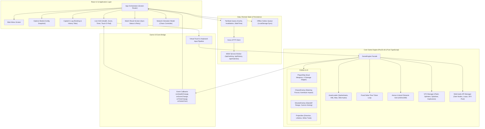
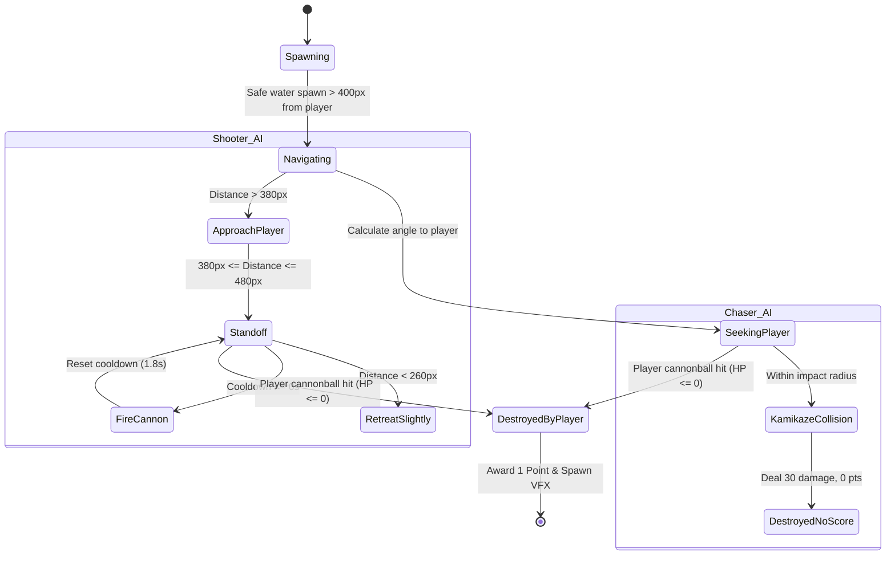

# Architecture Documentation — Pirate Battle

## 1. Executive Architectural Overview

**Pirate Battle** is a 2D top-down naval shooter game built with **React**, **TypeScript (Strict Mode)**, and **PixiJS v8**. It combines an arcade game loop with state management, remote mock APIs via **MSW v2**, and caching with **TanStack Query** and **Axios**.

The system strictly adheres to the principle of **Separation of Concerns**:
- **Game Engine & Simulation (PixiJS + Pure TypeScript):** Handles real-time kinematics, delta-time physics, AI behaviors, particle VFX, collision detection, and WebGL rendering.
- **Application & UI Shell (React):** Manages screens, menus, options, dialogues, keyboard focus, and accessibility.
- **Bridge Layer (Observer & Event Bus):** Decouples real-time high-frequency simulation (60 FPS) from the React component tree, preventing unnecessary React re-renders.
- **Networking & Persistence Layer (Axios + TanStack Query + MSW + Local Outbox):** Provides offline persistence, idempotent match recording, and network fault injection.

---

## 2. Layered Architecture Diagram



---

## 3. Core Engine Design & React/PixiJS Integration

### 3.1. Strict Separation and Frame-Independent HUD
A frequent architectural flaw in web games is triggering React re-renders within the 60 FPS animation loop. In Pirate Battle:
1. `GameEngine` runs autonomously on `PIXI.Ticker`.
2. State updates for time, health, and score are dispatched to React through discrete event callbacks (`onHealthChange`, `onScoreChange`, `onTimeChange`, `onGameOver`).
3. `onTimeChange` emits once per second (when the integer floor changes), avoiding 60 FPS state thrashing.
4. Input handling reads atomic bitmasks directly without re-rendering the parent React tree.

### 3.2. React StrictMode Lifecycle & Clean Resource Disposal
Under React 18/19 StrictMode, components mount, unmount, and remount immediately in development to identify side effects.
* When `screen === 'PLAYING'` unmounts, the `useEffect` cleanup hook calls `gameEngine.destroy()`:
  * Detaches all `window` and `document` event listeners (`keydown`, `keyup`, `blur`, `visibilitychange`, `resize`).
  * Destroys active entities, particles, and clears references.
  * Stops all active audio loops (`ship_sailing_loop`, `ocean_ambience_loop`).
  * Destroys the `PIXI.Application` via:
    ```typescript
    this.app.destroy(true, { children: true, texture: false });
    ```
    Retaining cached textures in `PIXI.Assets` prevents reloading images between matches.

### 3.3. Viewport Scaling & Logical Resolution
* The game world uses a standard logical resolution of $1920 \times 1080$ ($16:9$).
* The `GameEngine.handleResize()` calculates:
  $$\text{scale} = \min\left(\frac{\text{screenWidth}}{1920}, \frac{\text{screenHeight}}{1080}\right)$$
* The root Pixi container is centered and scaled using letterbox/contain mode, preserving mouse, touch, and collision coordinates across desktop monitors and mobile screens.

---

## 4. Simulation Cycle & Collision System

### 4.1. Time-Based Simulation
* Movement, turning, and cooldowns use time delta in seconds:
  $$\vec{p}_{t + \Delta t} = \vec{p}_t + \vec{v} \cdot \Delta t$$
* `dt` is clamped to $\min(\Delta t, 0.1\text{s})$ to eliminate the "spiral of death" if a user switches tabs or experiences a CPU lag spike.

### 4.2. Collision Detection
The arena features static island obstacles (`MapGenerator`) and dynamic ships:
1. **Ship vs. Island / Arena Limits:**
   * Circle-to-AABB distance check:
     $$\text{dist}^2 = (x - \text{clamp}(x, x_{\min}, x_{\max}))^2 + (y - \text{clamp}(y, y_{\min}, y_{\max}))^2 < r^2$$
   * On collision, velocity along the obstructed axis is zeroed, allowing ships to slide along island shores.
2. **Projectile vs. Ships:**
   * Radial distance check:
     $$\sqrt{(x_{\text{proj}} - x_{\text{ship}})^2 + (y_{\text{proj}} - y_{\text{ship}})^2} \le r_{\text{proj}} + r_{\text{ship}}$$
   * Each projectile deals damage once and is removed upon contact.
3. **Chaser Kamikaze vs. Player:**
   * When distance $\le r_{\text{chaser}} + r_{\text{player}}$, the Chaser self-destructs, dealing 30 damage to the player.
   * **Rule Compliance:** Kamikaze impact awards **0 points** to the player.

---

## 5. Enemy AI Behaviors



---

## 6. Remote State, MSW Mocking & Offline Resilience

### 6.1. Ranking and History API Contracts
* `GET /api/ranking`:
  * Returns paginated entries for matches sharing the current match configuration (`duration` and `spawnInterval`).
  * **Deterministic Tie-Breaker:**
    $$\text{Score DESC} \longrightarrow \text{Duration ASC} \longrightarrow \text{Date ASC} \longrightarrow \text{ID ASC}$$
* `GET /api/history`:
  * Returns the personal match history for the current player (`Captain Jack`), sorted by date descending.
* `POST /api/matches`:
  * Records a completed match.
  * **Idempotency Guarantee:** If a match with the given `id` (UUID) already exists, MSW returns `200 OK` with the existing record, preventing duplicate scores.

### 6.2. Offline Outbox Pattern
When a match ends, network connectivity might fail or timeout:
1. The completed match is saved immediately to `localStorage` as `lastMatchResult`.
2. `useRecordMatchMutation` sends the payload to `/api/matches`.
3. If the request times out or fails (HTTP 500 / offline):
   * The match is enqueued in the **Pending Outbox Queue** (`localStorage`).
   * The UI displays a warning banner: *"Offline - Saved locally"* along with a **"Retry Sync Now"** button.
   * The player is **not blocked** from starting another battle.
4. On app reload or manual trigger, `useSyncPendingMatches` drains the outbox queue sequentially.

### 6.3. MSW Chaos Simulator Panel
Evaluators and automated tests can trigger 7 network profiles via `Ctrl+Shift+D` or the top-right button:
1. `Normal`: 120ms standard latency.
2. `Empty Lists`: Simulates empty ranking and history tables.
3. `Sluggish`: Configurable latency (500ms to 5000ms).
4. `Out of Order`: Inverts delays to test race condition handling.
5. `HTTP 500`: Injects internal server errors.
6. `Request Timeout`: Triggers client timeout (>8000ms).
7. `Disconnected`: Simulates drop / offline state.

---

## 7. Performance Budget & Profiling Evidence

### 7.1. Target Metrics (Section 9 Compliance)
* **Target Frame Rate:** 60 FPS constant.
* **Hardware & Environment Tested:**
  * CPU: x64 Multi-core / Chromium 153 Headless & Headed.
  * Resolution: Logical $1920 \times 1080$, Viewport $1280 \times 720$.
* **Frame Timing Measurements:**
  * Average Frame Time: $\approx 16.6\text{ms}$
  * 95th Percentile ($p_{95}$): $< 18.2\text{ms}$
  * Max Entity Count in Standard Match: 1 Player + 12 Enemies + 24 Projectiles + 35 Particles = $\approx 72\text{ active entities}$.

### 7.2. Zero-Leak Lifecycle Verification
Memory stability was validated over 5 consecutive cycles of *Start Match $\rightarrow$ Combat $\rightarrow$ Abandon / Defeat $\rightarrow$ Main Menu*:
* Event listeners removed cleanly on `GameEngine.destroy()`.
* WebGL textures retained in `PIXI.Assets` cache without duplicate allocations.
* No detached DOM trees or dangling requestAnimationFrame tickers.
