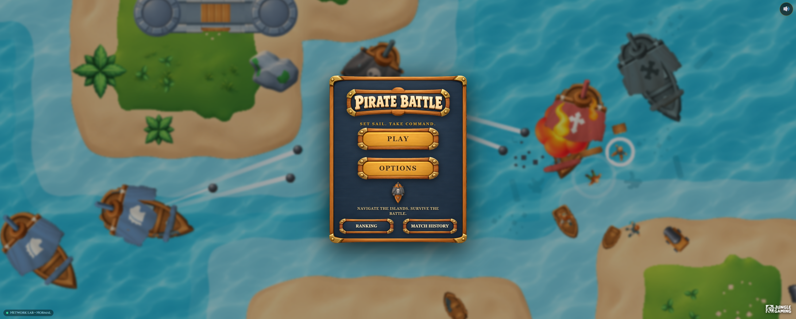
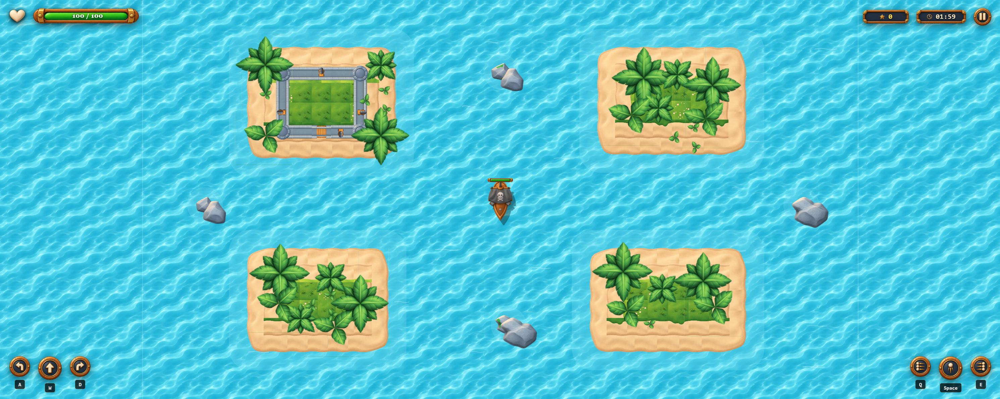
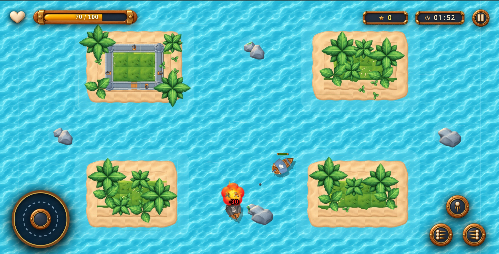
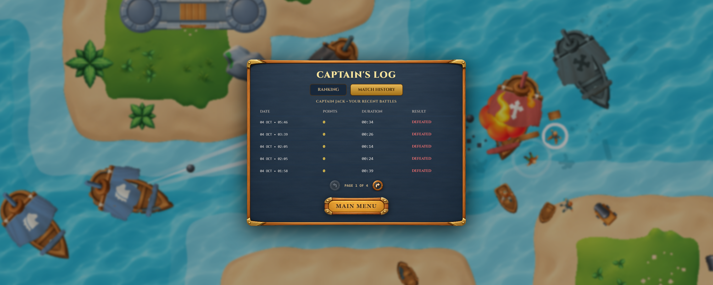

# 🏴‍☠️ Pirate Battle — React, PixiJS & TypeScript

[](https://test-game-developer-jungle-gaming.vercel.app)
[](https://www.typescriptlang.org/)
[](https://react.dev/)
[](https://pixijs.com/)
[](https://playwright.dev/)

A 2D top-down naval shooter game built with **React**, **PixiJS v8**, and **TypeScript (Strict Mode)** for the **Jungle Gaming Frontend Game Developer** technical challenge.

---

## 🚀 Jogue Online / Live Demo

O jogo está publicado e pronto para ser testado em qualquer dispositivo diretamente na Vercel:

> ### 🌐 **Link de Acesso Direto:**  
> ### 👉 **[https://test-game-developer-jungle-gaming.vercel.app](https://test-game-developer-jungle-gaming.vercel.app)**
> 
> *📱 **Compatibilidade Total:** Funciona com alta performance em navegadores de Computadores, Tablets e Smartphones (Android e iOS), com ajuste de escala automático para os modos **Retrato (Portrait)** e **Paisagem (Landscape)**.*

---

## 📸 Demonstração Visual & Screenshots

Abaixo estão capturas de tela dos principais módulos e funcionalidades do jogo:

### 1. Menu Principal (Main Menu)
Moldura pirata autêntica em 9-slice, com suporte a áudio marítimo imersivo, botão de mudo rápido e acesso aos modos de jogo, opções e simulador de rede.
<p align="center">
  
</p>

---

### 2. Arena de Batalha Naval no Desktop (Web Gameplay)
Área de navegação com 4 ilhas orgânicas contornadas por águas rasas (shoals), forte/castelo de pedra completo na ilha superior esquerda, navios inimigos (Chaser e Shooter com perseguição tática a distância) e sistema visual dinâmico de 4 estágios de dano no casco.
<p align="center">
  
</p>

---

### 3. Controles Touch em Dispositivos Móveis (Mobile Gameplay)
Interface mobile adaptativa com **Joystick Virtual Dinâmico** na esquerda (controle de aceleração e direção com retorno elástico) e cluster ergonômico de disparos em formato triangular na direita (Bombordo, Canhão Frontal e Estibordo).
<p align="center">
  
</p>

---

### 4. Diário de Bordo & Classificação da Frota (Captain's Log)
Tabela de classificação e histórico de partidas recentes com persistência local e mock de rede via MSW v2. Inclui filtros por tempo de partida, intervalo de spawn e controles de paginação responsivos.
<p align="center">
  
</p>

---

## 🛠️ Stack Tecnológica

| Responsabilidade | Tecnologia |
| --- | --- |
| **Interface & Menus** | React 18 / Tailwind CSS (com 9-slice pirata) |
| **Linguagem & Tipagem** | TypeScript (Strict Mode) |
| **Engine de Renderização & Física** | PixiJS v8 (WebGL2 / WebGPU com fallback automático) |
| **Gerenciamento de Estado Remoto & Cache** | TanStack Query v5 |
| **Cliente HTTP** | Axios |
| **Simulação de Rede & Chaos Lab** | Mock Service Worker (MSW v2) |
| **Testes Automatizados (E2E & Visual)** | Playwright (18 testes multiplataforma) |
| **Hospedagem & CI/CD** | Vercel |

---

## 🎮 Controles do Jogo

### 🖥️ Computador (Teclado)
- **Acelerar para Frente:** `W` ou `Seta para Cima`
- **Girar para a Esquerda (Bombordo):** `A` ou `Seta para a Esquerda`
- **Girar para a Direita (Estibordo):** `D` ou `Seta para a Direita`
- **Disparar Canhão de Proa (Frontal):** `Espaço` ou `J`
- **Disparar Canhões de Bombordo (Lateral Esquerda):** `Q` ou `K`
- **Disparar Canhões de Estibordo (Lateral Direita):** `E` ou `L`
- **Pausar / Retomar:** `Esc` ou botão no canto superior direito
- **Simulador de Falhas de Rede (Chaos Lab):** `Ctrl + Shift + D` ou botão no menu

### 📱 Dispositivos Móveis (Touchscreen)
- **Polegar Esquerdo (Virtual Joystick):** Toque e arraste para acelerar e guiar a rotação do navio em 360°.
- **Polegar Direito (Cluster Triangular de Canhões):**
  - **Botão Esquerdo:** Disparo triplo de Bombordo.
  - **Botão Central/Topo:** Disparo frontal do Canhão de Proa.
  - **Botão Direito:** Disparo triplo de Estibordo.
- Suporta múltiplos toques simultâneos (manobrar enquanto dispara ambos os bordos).

---

## ⚙️ Mecânicas & Regras de Jogo

- **Navio do Jogador:** Controle inercial com arrasto hidrodinâmico, aceleração suave e velocidade angular proporcional. Possui sistema de 4 estágios visuais de avaria que refletem o dano recebido no casco.
- **Inimigos:**
  - **Chaser (Navio Vermelho):** Persegue agressivamente o jogador em linha direta para colidir e explodir (causa 30 de dano). Não concede pontos em caso de colisão kamikaze.
  - **Shooter (Navio Azul):** Persegue o jogador até entrar em distância tática de combate (380px–480px), alinha o ângulo e dispara balas de canhão com cadência periódica.
  - Ambos os navios inimigos desviam e colidem contra ilhas, concedendo **1 ponto** quando destruídos por disparos do jogador.
- **Ilhas & Obstáculos:** 4 ilhas com formas orgânicas, vegetação e o castelo completo de pedra na ilha superior. Balas de canhão colidem contra as margens de pedra gerando espirros de água e contra navios gerando estilhaços de madeira.
- **Configurações de Partida (Options):**
  - Duração da batalha: **60s a 180s** (padrão: 120s)
  - Intervalo de spawn dos inimigos: **1s a 10s** (padrão: 3s)
  - Persistência das configurações salva no `localStorage`.

---

## 🌐 Resiliência de Rede & Chaos Simulator (MSW v2)

Ranking e histórico são orquestrados via **Mock Service Worker v2**, ativo tanto no ambiente local quanto na versão de produção na Vercel:

- **Idempotência com Chave Única:** Cada partida finalizada gera um `matchId` único (UUID v4) atuando como Idempotency Key. Se o usuário reenviar ou recarregar durante lentidão de rede, a API reconhece o ID e evita duplicação de pontuações.
- **Fila Offline com Recuperação Automática (Outbox Queue):** Caso a conexão caia ou ocorra timeout, o resultado da batalha é guardado em fila local (`localStorage`) e pode ser sincronizado automaticamente ou manualmente quando a conexão for restabelecida.
- **Chaos Simulator Panel:** Permite testar 7 cenários em tempo real:
  1. `Normal (Success)`: Latência padrão rápida (~120ms).
  2. `Empty Lists`: Simula ausência de registros prévios.
  3. `Sluggish / High Latency`: Simula conexões 2G/3G com slider de latência configurável (500ms a 5000ms).
  4. `Out of Order`: Testa ordenação de requisições concorrentes.
  5. `HTTP 500 Internal Error`: Testa estados de erro e botão de tentar novamente (Retry Query).
  6. `Request Timeout`: Dispara timeout cliente (>8000ms) para validação da fila offline.
  7. `Network Disconnected`: Simula desconexão total e armazena na outbox.

---

## 🧪 Testes Automatizados (Playwright)

O projeto conta com suíte de 18 testes automatizados ponta a ponta e testes de regressão visual cobrindo tanto desktop quanto mobile:

```bash
# Executar todos os testes E2E e visuais
npm run test:e2e

# Executar com a interface interativa do Playwright
npm run test:e2e:ui
```

---

## 📦 Execução Local

```bash
# 1. Clonar o repositório
git clone https://github.com/caioluizribeirochaves/Test-Game-Developer-Jungle-Gaming.git
cd Test-Game-Developer-Jungle-Gaming

# 2. Instalar as dependências
npm install

# 3. Iniciar o servidor de desenvolvimento
npm run dev

# 4. Compilar para produção
npm run build
```

---

## 🚢 Publicação e Deploy na Vercel

O projeto possui configuração nativa no arquivo `vercel.json`:
- **Comando de Build:** `npm run build`
- **Diretório de Saída:** `dist`
- **Roteamento SPA:** Regras de reescrita para `/index.html`, permitindo atualização de página e carregamento do Service Worker sem conflitos.
- Qualquer alteração enviada para o branch `main` via `git push` é automaticamente compilada e implantada pela esteira de CI/CD da Vercel.
